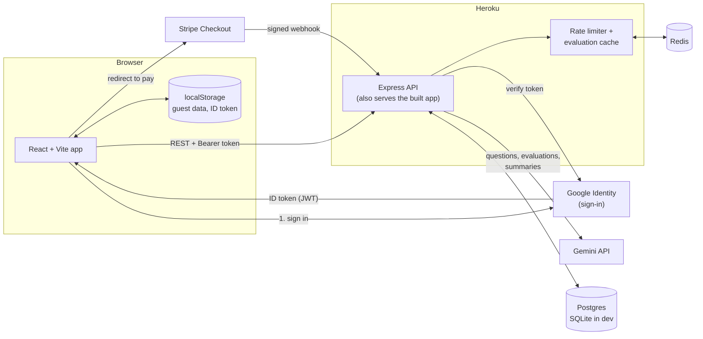
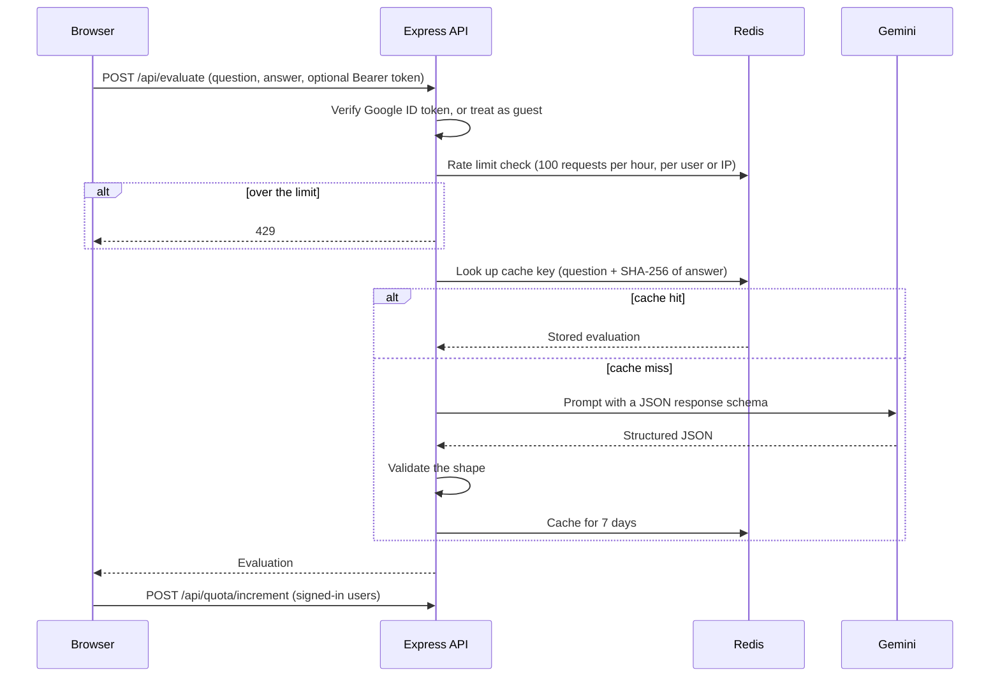

# ACE: AI Coach for Employment

Live at **[ace-interview.app](https://ace-interview.app)**

ACE is a practice tool for technical interviews. You pick a skill (say, Java or System Design) and an experience level, and it asks you interview questions. You type an answer, and an AI mentor tells you what you got right, what you missed, and what a good answer looks like. Afterwards it summarises the concepts you should revise.

I built it to learn how the pieces of a small paid web product fit together: login, quotas, payments, caching, rate limiting, and calling an LLM safely from a server.

## What it does

- Generates questions for any skill at entry, mid, or expert level
- Evaluates free-text answers and classifies them as correct, partially correct, or incorrect
- Keeps a skill rating that moves with your answers (+10 correct, +5 partial, -5 wrong or "I don't know")
- Saves questions you didn't get to, and serves them first next time
- Writes a short revision summary per skill at the end of a session
- Works as a guest (2 skills, 2 sessions); signing in with Google unlocks 5 skills and 50 questions a week
- Sells extra question packs through Stripe Checkout

## How it works



The browser never talks to Gemini. The API key lives only on the server, and every AI call goes through the Express API so it can be authenticated, rate limited, and cached.

### What happens when you submit an answer



If Gemini fails, the API returns a 502 and nothing is cached. The client shows a retry message and does not use up quota or change your rating.

### Design decisions worth explaining

- **Identity is the Google `sub` claim.** The browser sends the Google ID token, and the server verifies the signature and audience on every request using `google-auth-library`. There are no passwords and no session table.
- **Guests are allowed on the AI endpoints.** An optional-auth middleware attaches a user id when a valid token is present and otherwise lets the request through as a guest, rate limited by IP. The guest limits on skills and sessions are enforced in the browser, so they are a product nudge and not a security boundary.
- **The server decides prices.** The client sends a quantity (10, 50, or 100). The server looks the price up in its own table, so a tampered request can't change what you pay.
- **Payments are confirmed by webhook, not by the redirect.** Stripe calls `/webhook` with a signed event, the server verifies the signature against the raw request body, and only then credits the user's quota.
- **Quota resets weekly (Monday).** The reset is checked lazily when the quota is read, so there is no cron job.
- **One codebase, two databases.** SQLite for local development and Postgres on Heroku, behind a small `query()` wrapper.
- **Cache keys include a hash of the answer.** Identical question and answer pairs reuse a stored evaluation, which saves model calls without mixing up different answers.

## Tech stack

| Area | Choice |
| --- | --- |
| Frontend | React 19, TypeScript, Vite, Tailwind |
| Backend | Node 24, Express |
| AI | Google Gemini (`gemini-3.8-flash`, configurable) via `@google/genai` |
| Auth | Google Identity Services, ID token verified server-side |
| Data | Postgres in production, SQLite locally, Redis for caching and rate limiting |
| Payments | Stripe Checkout and webhooks |
| Logging | Winston |
| Hosting | Heroku |

## Project layout

```
App.tsx, index.tsx     React entry points and top-level state
components/            UI pieces (practice view, modals, header)
services/gemini.ts     Client helper that calls /api/evaluate
config/                Purchase pack definitions
server/                Express API, auth, database, Gemini and Redis clients
```

## Running it locally

You need Node 24, a Redis instance, a Gemini API key, a Google OAuth client ID, and (to test payments) a Stripe account.

```bash
npm install
cp .env.example .env.local   # then fill in the values below
npm start                    # API on http://localhost:3001
npm run dev                  # frontend on http://localhost:5173
```

Environment variables, read from `.env.local`:

| Variable | Purpose |
| --- | --- |
| `GEMINI_API_KEY` | Gemini key. Server only, never exposed to the browser. |
| `GEMINI_MODEL` | Optional. Defaults to `gemini-3.8-flash`. |
| `GOOGLE_CLIENT_ID` | OAuth client ID used to verify sign-in tokens |
| `STRIPE_SECRET_KEY` | Creates Checkout sessions |
| `STRIPE_WEBHOOK_SECRET` | Verifies webhook signatures (`whsec_...`) |
| `CLIENT_URL` | Where Stripe sends people after paying, e.g. `http://localhost:5173` |
| `REDIS_URL` | e.g. `redis://localhost:6379` |
| `DATABASE_URL` | Postgres connection string, production only |
| `SQLITE_DB_PATH` | Optional. Local SQLite file, defaults to `./dev.sqlite` |

The Google client ID is also hard-coded in `App.tsx` for the browser. It is public by design, but change it to your own if you fork this.

For Stripe webhooks locally, run `stripe listen --forward-to localhost:3001/webhook` and use the `whsec_...` it prints as `STRIPE_WEBHOOK_SECRET`.

## Known limitations

I'd rather list these than have you find them:

- The Google ID token is kept in `localStorage`, which is exposed if the site ever has an XSS bug. Moving it to an HttpOnly cookie is the planned fix (see `ISSUES.md`).
- Unanswered questions and revision summaries are stored as JSON text on the `users` row. That is fine at this size, but it should become proper tables.
- The webhook doesn't record processed event ids, so a retried event could credit a user twice.
- There are no automated tests yet.
- CORS is open and should be restricted to the production origin.

More of the reasoning behind early decisions is in [`LESSONS.md`](LESSONS.md).

## License

ISC, see [`LICENSE`](LICENSE).
