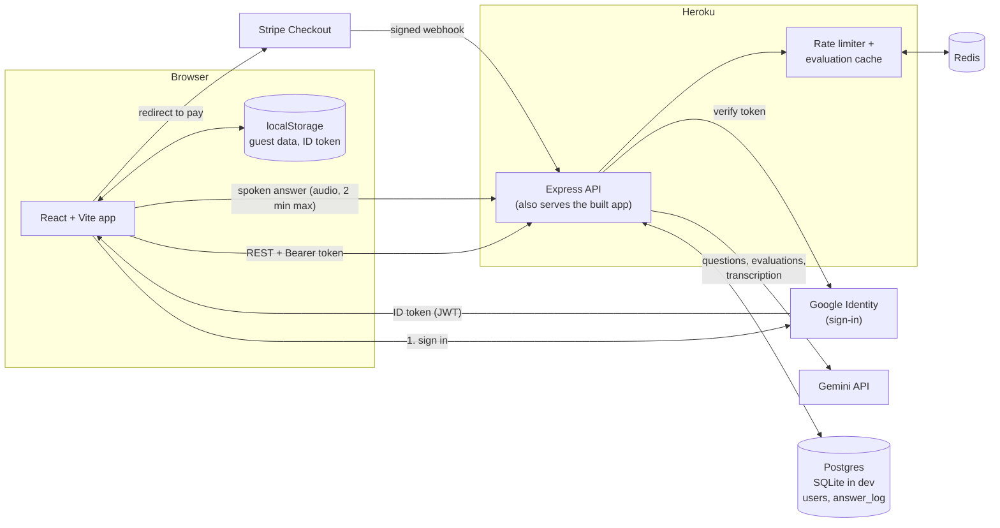
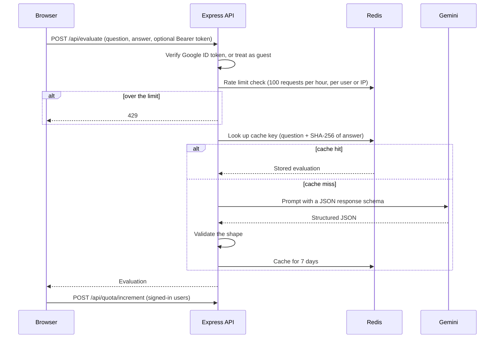
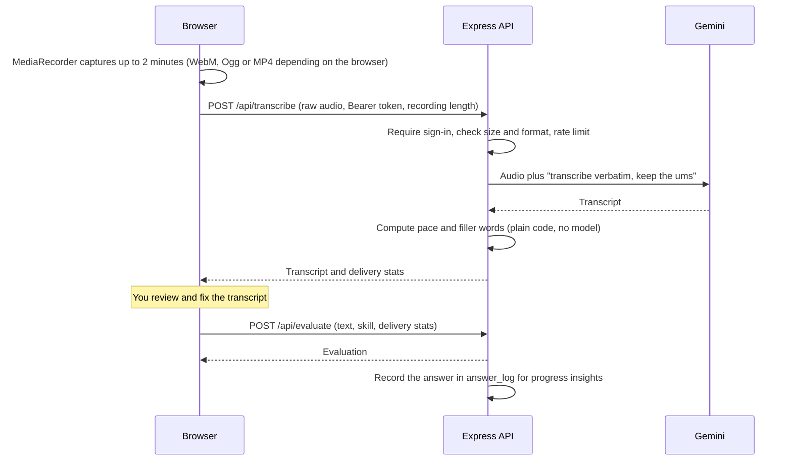

# ACE: AI Coach for Employment

Live at **[ace-interview.app](https://ace-interview.app)**

ACE is a practice tool for technical interviews. You pick a skill (say, Java or System Design) and an experience level, and it asks you interview questions. You answer by typing or by speaking out loud, and an AI mentor tells you what you got right, what you missed, and what a good answer looks like. If you spoke, it also coaches your delivery: pace and filler words. Over time it tracks what you keep missing and what you have finally nailed, and suggests what to practise next.

I built it to learn how the pieces of a small paid web product fit together: login, quotas, payments, caching, rate limiting, and calling an LLM safely from a server.

## What it does

- One tap start: pick a starter skill (or press Practice on any skill) and a short round begins at a recommended level. Change opens the level and length options
- Generates questions for any skill at entry, mid, or expert level
- Evaluates free-text answers and classifies them as correct, partially correct, or incorrect
- Lets signed-in users answer out loud (desktop or mobile), then shows a transcript to review and edit before submitting
- Coaches delivery on spoken answers: words per minute against a typical interview range, and a count of filler words with plain-language tips
- Progress view: practice streak, week-over-week accuracy, per-skill trends, concepts you keep missing versus ones you have mastered, speaking trends, and a suggested next step
- Built to be accessible: everything works from the keyboard, nothing relies on colour alone, the progress view opens with a one-sentence summary, and typing is always available as an alternative to voice
- After each answer it shows how your rating moved and offers Next question or Try again (a practice retry that is not recorded and does not change your rating). Each round ends with a short recap
- The home screen has an Up next card that suggests what to practise, and signed-in users see their practice streak in the header
- Keeps a skill rating that moves with your answers (+10 correct, +5 partial, -5 wrong or "I don't know")
- Saves questions you didn't get to, and serves them first next time
- A Review button on every skill opens a study sheet built from your whole history: the questions worth another try (with a one-click "practise these" session), concepts you keep missing, concepts you have mastered, and how that skill is trending
- Works as a guest (2 skills, 2 sessions); signing in with Google unlocks 5 skills and 50 questions a week
- Sells extra question packs through Stripe Checkout

## How it works



The browser never talks to Gemini. The API key lives only on the server, and every AI call goes through the Express API so it can be authenticated, rate limited, and cached.

### What happens when you submit an answer



If Gemini fails, the API returns a 502 and nothing is cached. The client shows a retry message and does not use up quota or change your rating.

### What happens when you answer out loud



Audio is never stored. It is held in memory long enough to send to Gemini and then dropped.

### Design decisions worth explaining

- **Identity is the Google `sub` claim.** The browser sends the Google ID token, and the server verifies the signature and audience on every request using `google-auth-library`. There are no passwords and no session table.
- **Guests are allowed on the AI endpoints.** An optional-auth middleware attaches a user id when a valid token is present and otherwise lets the request through as a guest, rate limited by IP. The guest limits on skills and sessions are enforced in the browser, so they are a product nudge and not a security boundary.
- **The server decides prices.** The client sends a quantity (10, 50, or 100). The server looks the price up in its own table, so a tampered request can't change what you pay.
- **Payments are confirmed by webhook, not by the redirect.** Stripe calls `/webhook` with a signed event, the server verifies the signature against the raw request body, and only then credits the user's quota.
- **Quota resets weekly (Monday).** The reset is checked lazily when the quota is read, so there is no cron job.
- **One codebase, two databases.** SQLite for local development and Postgres on Heroku, behind a small `query()` wrapper.
- **Delivery stats are ordinary code, not a model call.** Gemini only transcribes (and is told to keep the "ums"). Pace is words divided by recording time, and filler words are matched against a list. That makes the numbers repeatable, cheap, and unit-testable. The list is deliberately conservative: "like" only counts when it is set off by commas, because it is usually a real word.
- **Progress comes from a normalized `answer_log` table.** Each evaluated answer by a signed-in user is one row (skill, outcome, concepts known and missed, optional pace and filler counts). The insights endpoint reads those rows and a pure function turns them into streaks, trends, recurring gaps and a suggested next step. No model call is involved, so it is instant and free. Day boundaries use the user's own time zone. Users can delete their history from the progress view.
- **Ratings move with the level.** The expertise rating used to change by a flat amount per answer, so ten correct Entry-level answers took a skill to 100%. Now easy questions earn less and cost more when missed (Entry-level is +5, +3 or -8; Mid-level +10, +5 or -5; Expert +15, +8 or -3), and each level has a ceiling: Entry-level answers can raise a rating to 40, Mid-level to 75, and only Expert answers reach 100. The practice dialog says so up front, and explains when the chosen level can no longer help.
- **The Review sheet is computed, not generated.** It reads the recorded answers for one skill and works out the latest result per question, the concepts missed or since mastered, and the trend. No model call, so it is instant and free, and it works from any device because the history lives on the server. "Practise these" starts a session from the missed questions using the level each was asked at, and a question leaves the list once its latest answer is correct, which is a simple form of spaced repetition.
- **Voice is for signed-in users.** Audio is the most expensive request the API accepts, so it sits behind login, a 5 MB cap, and the same per-user rate limit as everything else.
- **Cache keys include a hash of the answer.** Identical question and answer pairs reuse a stored evaluation, which saves model calls without mixing up different answers.

## Tech stack

| Area | Choice |
| --- | --- |
| Frontend | React 19, TypeScript, Vite, Tailwind, MediaRecorder for voice |
| Backend | Node 24, Express |
| AI | Google Gemini (`gemini-3.8-flash`, configurable) via `@google/genai`, used for questions, evaluation and audio transcription |
| Auth | Google Identity Services, ID token verified server-side |
| Data | Postgres in production, SQLite locally, Redis for caching and rate limiting |
| Payments | Stripe Checkout and webhooks |
| Logging | Winston |
| Hosting | Heroku |

## Project layout

```
App.tsx, index.tsx     React entry points and top-level state
components/            UI pieces (practice view, modals, header)
hooks/                 Reusable hooks, including the audio recorder
services/              Client helpers for the API (evaluate, transcribe, progress)
config/                Purchase pack definitions
server/                Express API, auth, database, Gemini and Redis clients
server/deliveryStats.js  Pace and filler word analysis
server/insights.js       Turns the answer log into progress insights
test/                  Unit and HTTP tests (node:test)
```

## Running it locally

You need Node 24, a Redis instance, a Gemini API key, a Google OAuth client ID, and (to test payments) a Stripe account.

```bash
npm install
cp .env.example .env.local   # then fill in the values below
npm start                    # API on http://localhost:3001
npm run dev                  # frontend on http://localhost:5173
npm test                     # server tests, no network or Redis needed
```

Environment variables, read from `.env.local`:

| Variable | Purpose |
| --- | --- |
| `GEMINI_API_KEY` | Gemini key. Server only, never exposed to the browser. |
| `GEMINI_MODEL` | Optional. Defaults to `gemini-3.8-flash`. |
| `GOOGLE_CLIENT_ID` | OAuth client ID used to verify sign-in tokens |
| `STRIPE_SECRET_KEY` | Creates Checkout sessions |
| `STRIPE_WEBHOOK_SECRET` | Verifies webhook signatures (`whsec_...`) |
| `CLIENT_URL` | Where Stripe sends people after paying, e.g. `http://localhost:5173` |
| `REDIS_URL` | e.g. `redis://localhost:6379` |
| `DATABASE_URL` | Postgres connection string, production only |
| `SQLITE_DB_PATH` | Optional. Local SQLite file, defaults to `./dev.sqlite` |

The Google client ID is also hard-coded in `App.tsx` for the browser. It is public by design, but change it to your own if you fork this.

For Stripe webhooks locally, run `stripe listen --forward-to localhost:3001/webhook` and use the `whsec_...` it prints as `STRIPE_WEBHOOK_SECRET`.

## Known limitations

I'd rather list these than have you find them:

- The Google ID token is kept in `localStorage`, which is exposed if the site ever has an XSS bug. Moving it to an HttpOnly cookie is the planned fix (see `ISSUES.md`).
- Unanswered questions are still stored as JSON text on the `users` row. The `answer_log` table is properly normalized, and that should follow. Summaries written by the old AI-based review are kept in the `users` table and shown as an "earlier summary" in the Review dialog, but nothing writes new ones.
- The webhook doesn't record processed event ids, so a retried event could credit a user twice.
- The server has tests (delivery stats, insights, HTTP routes, the database layer). The React UI does not have committed tests; I exercised the voice and progress flows in a real browser by hand.
- Voice recording is tested in Chromium with a fake microphone. Safari and iOS record MP4 instead of WebM and the code handles that, but it needs a check on a real device.
- Filler word detection is a word list, so it will miss some fillers and occasionally count a real word. Treat the numbers as a guide.
- Pace is measured over the whole recording, so a long pause at the start or end lowers it.
- CORS is open and should be restricted to the production origin.

More of the reasoning behind early decisions is in [`LESSONS.md`](LESSONS.md).

## License

ISC, see [`LICENSE`](LICENSE).
